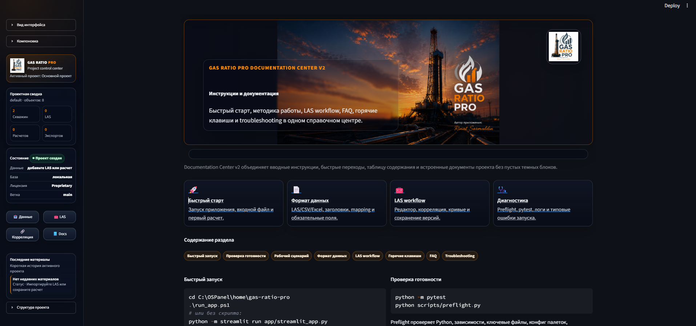

# GAS RATIO PRO

Профессиональное приложение для анализа LAS-файлов, интерпретации каротажа и петрофизических расчетов.

---

## Интерфейс приложения

  

> Актуальный внешний вид рабочего пространства Gas Ratio Pro.

---

## Возможности

- Управление проектами
- Well Manager
- LAS Explorer Professional
- LAS Editor
- LAS Correlation
- Formation Manager
- Plot Studio
- Statistics Center
- Dashboard Workspace
- Documentation Center
- Petrophysical Calculations
- Export PDF / PNG / SVG