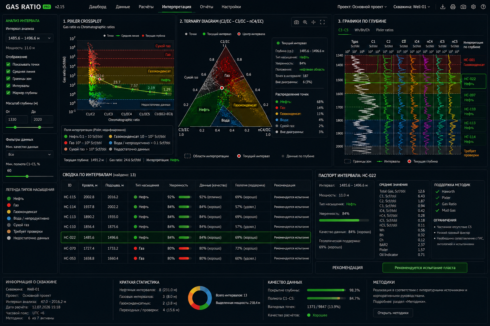

# GAS RATIO PRO



**GAS RATIO PRO** — профессиональная инженерная платформа для обработки, анализа, интерпретации и визуализации данных нефтегазовых скважин.

Проект предназначен для практической работы с LAS/Excel-данными, газовым каротажем, кривыми ГИС, интерпретацией углеводородных интервалов, подготовкой инженерных отчетов и дальнейшего развития в сторону петрофизики и геологического моделирования.


## Основные возможности

- импорт и просмотр LAS-файлов;
- импорт табличных данных из Excel/CSV;
- контроль качества исходных данных;
- расчет газогеохимических параметров и отношений;
- выделение и классификация углеводородных интервалов;
- учет литологии и непроницаемых перемычек;
- формирование объяснимой интерпретации;
- подготовка инженерных отчетов;
- визуализация кривых и интервалов;
- экспорт результатов;
- развитие в сторону петрофизического анализа и геологического моделирования.


## Установка

Требуется Python 3.10 или выше.

```bash
python -m venv .venv
```

Windows PowerShell:
```powershell
.\.venv\Scripts\Activate.ps1
```

Linux / macOS:
```bash
source .venv/bin/activate
```

Установите зависимости:
```bash
pip install -r requirements.txt
```

## Запуск
```bash
streamlit run app/streamlit_app.py
```

или:

```bash
python -m streamlit run app/streamlit_app.py
```
После запуска откройте адрес, который покажет Streamlit. Обычно это:

```text
http://localhost:8501
```

На Windows также можно использовать:
```powershell
.\run_app.ps1
```

## Статус проекта

Проект находится в активной стадии разработки.

## Автор проекта
**Сармулдин Р. Р.**
Инженер-программист, автор и разработчик программного комплекса **GAS RATIO PRO**.

## Лицензия
Частный проект. Все права защищены.

## Документация

- История изменений: `docs/CHANGELOG.md`
- Формулы и расчётные зависимости: `docs/formulas.md`
- Руководство пользователя: `docs/user_guide.md`
- Текущий статус: `docs/PROJECT_STATUS.md`
- Roadmap: `docs/PROJECT_ROADMAP.md`
